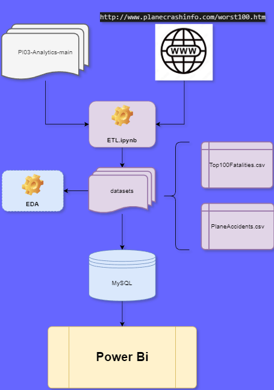

## PI-03 - Data Analyst Project: Analyzing the top 100 worst aviation disasters

In this project, I'll take a look at two datasets, one is provided by Henry(AccidentesAviones.csv) and the other was extracted from 'http://www.planecrashinfo.com/worst100.htm'(Top100Fatalities.csv). My main idea is to analyse these top 100 disasters and compare them to the larger spectrum of the 5000 accidents that are in AccidentesAviones.csv so we can see really what makes them stand out, or if it's only the amount of fatalities that has any correlation at all with it.

## Workflow Diagram

## Dataframe feature dictionary:

PlaneAccidents.csv:

    date:          the date of the accident
    
    declared_hour: the hour when the accident happenned
    
    route:         the locations the plane route had as objective
    
    operator:      the kind of operator/ organization where the operator works at
    
    flight_n:      flight id
    
    route_type:    purpose/ location of interest
    
    ac_type:       aircraft type
    
    registration:  HASH number registered 
    
    cn_ln:         construction/serial number or line/fuselage number
    
    aboard_total:  total people aboard  
    
    aboard_pass:   number of passengers aboard
    
    aboard_crew:   number of crew members aboard
    
    deceased_aboard_total: total number of people that died while being aboard
    
    deceased_aboard_pass:  number of passengers that died while being aboard
    
    deceased_aboard_crew:  number of crew members that died while being aboard
    
    deceased_not_on_total: total number of people that died while not being aboard
    
    summary: summary of the event

Top100Fatalities.csv:

    fatalities: # of total people that died in that particular occasion 

    date:       date the accident took place in

    location:   City, State (in USA) or location, Country (globally)

    carrier:    license of the airplane used 

    flight:     flight number identificator

    type:       type of airship used

    
